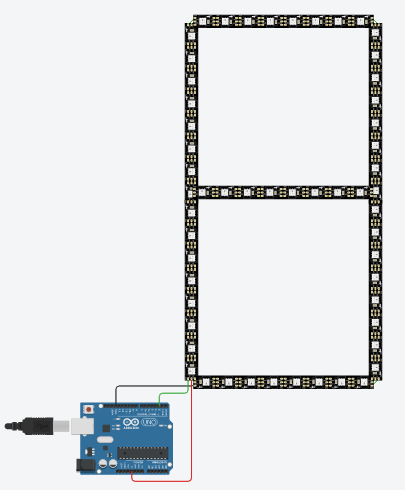

# Desafio 2 (**Arduino Uno**)
### Curso de Extensão (IFAL/Maceió - 2021): Computação Embarcada com Arduino Uno e ESP8266.
 

**Componentes**:
| Nome | Quantidade | Componente |
| ---- | ---------- | ---------- |
| U1   | 1          | Arduino Uno R3 |
| LED1, LED2, LED3, LED4, LED5, LED6, LED7 | 7          | Faixa de NeoPixel 8 |
  
- **Como Funciona?**
    Depois da definição da variável **pixels** do tipo *Adafruit_NeoPixel* da biblioteca **Adafruit_NeoPixel.h**, informando o número de pixels (**NUMPIXELS**) e o pin de OUTPUT do NeoPixel (**PIXEL_PIN**).inicializamos no *setup* com:
    ```cpp
    void setup() 
    {
        pixels.setBrightness(255); // Definição para padrão RGB.
        pixels.begin();
    }
    ```
    No **loop()** usaremos um *for* com limites até o **NUMPIXELS** para percorrer cada LED dos 7 NeoPixels.
    Usaremos a cor vermelha, padrão **RGB(255,0,0)**.
    ```cpp
      for(int i = 0; i < NUMPIXELS; i++)
      {
          pixels.setPixelColor(i, pixels.Color(255,0,0)); //Vermelho
          pixels.show();
      }
    ```